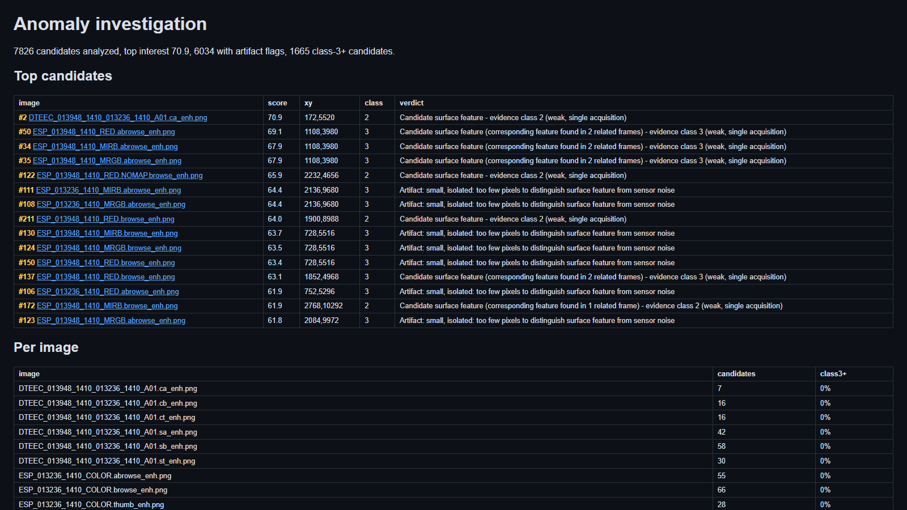

<p align="center">
  <picture>
    
  </picture>
</p>

# PLANETARY SCAN NODE :: HiRISE INTAKE

**Exclusive anomaly-detection pipeline for NASA HiRISE Mars & lunar imagery.**

`ACQUIRE → CATALOG → ENHANCE → DETECT → ANALYZE → ADJUDICATE`

<p align="center">
  <a href="https://github.com/Nortaq-PlayNexus/nasa-investigation/actions/workflows/ci.yml"></a>
  <a href="https://nortaq-playnexus.github.io/nasa-investigation/"></a>
  
  
  <a href="LICENSE"></a>
</p>

```
[ NAV ]  [01 signal][02 rig][03 setup][04 boot][05 archive][06 verify]
```

<pre>
IDENT ......... ANOMALY-SCAN
CLASS ......... PLANETARY IMAGERY PIPELINE
STATUS ........ ONLINE / DOSSIER LIVE
SOURCE ........ NASA HiRISE PDS (EXTRAS-ONLY)
FREQ .......... MARS + LUNAR UPLINK
LINK .......... /nasa-investigation
</pre>

---

## // 01 :: SIGNAL

A rigorous, reproducible pipeline for analyzing **public NASA HiRISE PDS imagery** and surfacing candidate anomalies for structured human review — built on the principle that nearly every "anomaly" in planetary imagery is a known sensor, compression, or viewing artifact. The system **documents, controls, and debunks** before anything is ever recorded as a finding.

**Design law:** EXTRAS-only acquisition from a single sanctioned source (`https://hirise-pds.lpl.arizona.edu/PDS/EXTRAS/`), comparing complete variant sets (B&W ↔ filtered ↔ ortho ↔ DTM) pixel-for-pixel to separate terrain from processing artifacts.

<p align="center">
  <em><code>// DECORATIVE READOUT: NOT A FACTUAL CLAIM</code></em>
</p>

---

## // 02 :: CAPABILITIES

<table>
<tr><td>🔬 Multi-scale detection</td><td>local-contrast flagging via box + annulus methods</td></tr>
<tr><td>🎯 Cross-band confirmation</td><td>pixel-level verification across B&W / filtered / ortho variants</td></tr>
<tr><td>📊 Statistical rigor</td><td>Benjamini–Hochberg FDR control, negative-control baselines, stress tests</td></tr>
<tr><td>🛡️ Artifact debunking</td><td>systematic checklist against known sensor/compression/optics artifacts</td></tr>
<tr><td>🗺️ Native PDS ingestion</td><td>reads <code>.IMG</code> EDRs directly with PDS3/PDS4 label parsing</td></tr>
<tr><td>📐 3D stereo confirmation</td><td>block-matching disparity maps with height estimation</td></tr>
<tr><td>🌗 Solar geometry scoring</td><td>shadow direction vs. solar azimuth alignment</td></tr>
<tr><td>🧪 Benchmark calibration</td><td>injected-blob sensitivity measurement with recall curves</td></tr>
<tr><td>💻 Full-stack dashboard</td><td>drag-drop analysis, live stats, searchable leads table</td></tr>
<tr><td>🤖 Discord bot</td><td>upload an image, get a pipeline verdict</td></tr>
<tr><td>📦 Standalone EXE</td><td>PyInstaller single-file builds — no installation required</td></tr>
</table>

---

## // 03 :: THE RIG

```
┌─────────────┐   ┌──────────────┐   ┌──────────────┐
│  DOWNLOAD   │──▶│   CATALOG    │──▶│   VERIFY     │
│  (EXTRAS)   │   │  + HASH      │   │  INTEGRITY   │
└─────────────┘   └──────────────┘   └──────────────┘
                                                 │
┌─────────────┐   ┌──────────────┐   ┌───────────▼──┐
│   DETECT    │◀──│   ENHANCE    │◀──│  NATIVE PDS  │
│  FLAGGING   │   │  STRETCH     │   │  READER      │
└──────┬──────┘   └──────────────┘   └──────────────┘
       │
┌──────▼──────┐   ┌──────────────┐   ┌──────────────┐
│   ANALYZE   │──▶│  ADJUDICATE  │──▶│  CONCLUSIONS │
│  MEASURE    │   │  CROSS-BAND  │   │  LEADS       │
└─────────────┘   └──────────────┘   └──────────────┘
```

<pre>
CORE PIPELINE ... Python 3.10+ / NumPy / Pillow / requests
IMAGE ANALYSIS .. SciPy (optional) / OpenCV (optional)
PUBLISHED SITE .. static dossier -> GitHub Pages
SOCIAL CARDS ... 4K generator (scripts/social_card_4k.py)
BUILD .......... PyInstaller / pip / pyproject.toml
TESTING ........ unittest + pytest (88 cases)
LINTING ........ ruff (100 char line length)
CI/CD .......... GitHub Actions (Linux + Windows, py 3.10-3.12)
</pre>

<p align="center">
  <a href="https://nortaq-playnexus.github.io/nasa-investigation/report/"></a>
  <br />
  <em><code>// live dossier: <a href="https://nortaq-playnexus.github.io/nasa-investigation/report/">OPEN THE PUBLIC REPORT →</a></code></em>
</p>

---

## // 04 :: SETUP

### Downlink from source

```bash
$ git clone https://github.com/Nortaq-PlayNexus/nasa-investigation.git
$ cd nasa-investigation
$ pip install -r requirements.txt
```

### Development rig

```bash
$ pip install -e .[dev]
$ python -m pytest tests/test_pipeline.py -v
```

### Standalone build

```bash
$ pip install -e .[dev]
$ python scripts/build_app.py              # pipeline CLI
$ python scripts/build_app.py --fullstack  # full dashboard + pipeline
```

---

## // 05 :: BOOT SEQUENCE

### Full pipeline

```bash
$ python scripts/run_pipeline.py --query "moon" --max 50
```

### Step-by-step intake

```bash
# 1. DOWNLOAD EXTRAS IMAGERY
$ python scripts/download_hirise_extras.py --query "crater" --max 30 --out data/raw

# 2. BUILD CATALOG W/ SOLAR GEOMETRY
$ python scripts/build_catalog.py

# 3. VERIFY INTEGRITY
$ python scripts/verify_downloads.py

# 4. ENHANCE
$ python pipeline/enhance.py --dir data/raw --out data/processed

# 5. DETECT ANOMALIES
$ python pipeline/detect.py --dir data/processed --out data/anomalies

# 6. MARK CANDIDATES
$ python pipeline/mark.py --candidates data/anomalies/candidates.csv --out data/anomalies/marked

# 7. ANALYZE
$ python pipeline/analyze.py --candidates data/anomalies/candidates.csv --out data/anomalies/analysis

# 8. ADJUDICATE LEADS
$ python pipeline/adjudicate.py --candidates data/anomalies/candidates.csv \
    --evaluated data/anomalies/analysis/evaluated.csv \
    --out data/anomalies/conclusions
```

### Self-test

```bash
$ python scripts/run_pipeline.py --selftest
```

---

## // 06 :: TUNING / CONFIG

| File | Purpose |
|------|---------|
| `config/pipeline.json` | Detector thresholds, adjudication gates, benchmark parameters |
| `config/sources.yaml` | EXTRAS-only source policy, variant taxonomy |
| `.env` | API tokens (Discord, LLM) — never commit |

| Variable | Required | Description |
|----------|:--------:|-------------|
| `DISCORD_TOKEN` | no | Discord bot token |
| `AI_LLM_KEY` | no | OpenRouter API key for vision LLM analysis |
| `AI_LLM_ENDPOINT` | no | LLM API endpoint (default: OpenRouter) |
| `AI_LLM_MODEL` | no | Vision model (default: llama-3.2-90b-vision) |

---

## // 07 :: TRANSMIT

### Full-stack dashboard

```bash
$ python scripts/build_app.py --fullstack
$ dist/nasa-fullstack/nasa-fullstack.exe     # http://127.0.0.1:8000
```

Drag-drop instant analysis, live stats, searchable leads table, showcase gallery.

### Discord bot

```bash
$ pip install -r requirements.txt
$ $env:DISCORD_TOKEN = "<your-token>"
$ python scripts/build_app.py --bot
```

Upload a Moon/Mars image → pipeline verdict with marked-up image and plain-language assessment.

### Stereo confirmation

```bash
$ python scripts/check_stereo.py --left pair_a.png --right pair_b.png \
    --candidates data/anomalies/candidates.csv --box 0 \
    --altitude-km 300 --baseline-km 1.2 --out data/anomalies/stereo
```

---

## // 08 :: ARCHIVE

<details>
  <summary><code>$ ls archive/ - OUTPUT FILES</code></summary>

| File | Description |
|------|-------------|
| `data/catalog/catalog.csv` | every file with mission, dimensions, SHA-256, solar geometry |
| `data/anomalies/candidates.csv` | detected regions (x, y, w, h, fill, score) |
| `data/anomalies/marked/` | images with anomaly boxes drawn |
| `data/anomalies/analysis/` | enhanced crops, measurements, artifact verdicts, HTML report |
| `data/anomalies/conclusions/adjudicated.csv` | cross-band confirmed leads with verdicts |
| `data/anomalies/audit.jsonl` | machine-readable audit trail of every run |
| `findings/` | only conclusions that survived the full methodology |
| [`site/report/`](https://nortaq-playnexus.github.io/nasa-investigation/report/) | public self-contained report (GitHub Pages) |
| [`site/results/`](https://nortaq-playnexus.github.io/nasa-investigation/results/) | public adjudication data + finding reports |

</details>

<details>
  <summary><code>$ cat manifest/pipeline - MODULES</code></summary>

| Script | Purpose |
|--------|---------|
| `scripts/download_hirise_extras.py` | EXTRAS-only acquisition from sanctioned LPL source |
| `scripts/download_pds.py` / `download_archive.py` | PDS / archive ingestion |
| `scripts/download_lroc.py` / `download_rover.py` / `download_nasa_library.py` | multi-source lunar/Mars ingest |
| `scripts/build_catalog.py` | catalog with SHA-256, solar geometry, immutable snapshot |
| `scripts/verify_downloads.py` | integrity verification + snapshot diff |
| `scripts/package_anomalies.py` | assemble conclusions, strips, finding reports |
| `scripts/chase_leads.py` | cross-band lead chasing / persistence |
| `scripts/check_stereo.py` | block-matching stereo disparity + height estimate |
| `scripts/social_card_4k.py` | 4K anomaly-dossier social cards |
| `scripts/build_site.py` | public dossier site (landing + explorer + report) |
| `scripts/report_stats.py` | conclusions summarizer |
| `scripts/validate_conclusions.py` | schema/rigor gate for published conclusions |

</details>

<details>
  <summary><code>$ cat manifest/tests - 88 CASES</code></summary>

Overlay detection, border exclusion, z-score p-values, Benjamini–Hochberg FDR, input validation, atomic writes, SHA-256 hashing, detector recall, blob injection, adjudication persistence/verdict/roundness, multi-band PDS cubes, stereo/change-detection, artifact flags, rigor metrics, dossier helpers (crop framing, dedupe, diverse preview).

Run:

```bash
$ python -m pytest tests/test_pipeline.py -v
$ python -m pytest tests/test_pipeline.py::TestDetect -v
$ python scripts/run_pipeline.py --selftest
```

</details>

<details>
  <summary><code>$ cat manifest/security</code></summary>

- **No hardcoded secrets** — all tokens loaded from environment variables
- **Path traversal protection** — `common.contain_path()` validates all file paths
- **Atomic writes** — crash-safe file operations with fsync + rename
- **Audit trail** — every pipeline operation recorded in `audit.jsonl`
- **Localhost only** — server binds to `127.0.0.1:8000` by default

Full policy: [SECURITY.md](SECURITY.md)

</details>

<details>
  <summary><code>$ cat manifest/roadmap</code></summary>

- [ ] overlay detection hardening
- [ ] streaming pipeline (process during download)
- [ ] confidence calibration against benchmarks
- [ ] multi-mission support (LROC NAC, CTX, Mars Express HRSC)
- [ ] automated stereo pair matching
- [ ] cross-platform builds (Linux, macOS)
- [ ] Docker deployment
- [ ] interactive map-based anomaly viewer

Full roadmap: [ROADMAP.md](ROADMAP.md)

</details>

---

## // 09 :: LEGAL // CREDITS

**License:** [MIT](LICENSE)

With thanks to:
- **NASA/JPL** — HiRISE PDS data (public domain)
- **University of Arizona LPL** — HiRISE processing pipeline
- **Python community** — NumPy, Pillow, SciPy, FastAPI

---

```
 ┌─────────────────────────────────────────────┐
 │  DOCUMENT → CONTROL → DEBUNK → CONFIRM      │
 │  ANOMALY RECEIVER // SIGNAL LOCKED          │
 │  PHANTOMTAPE CLASSIFIED ARCHIVE             │
 └─────────────────────────────────────────────┘
END OF TRANSMISSION
```