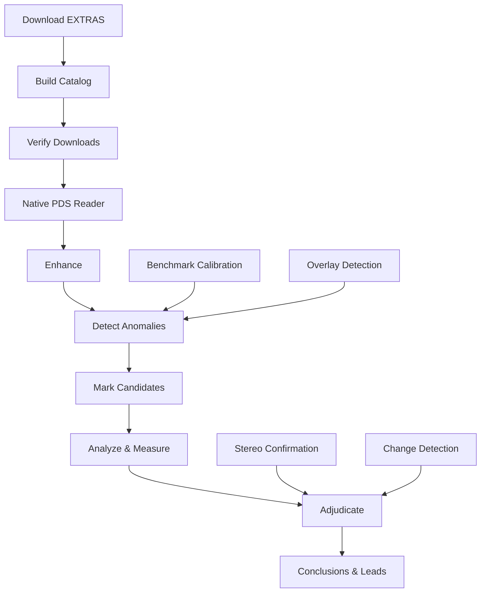

# Architecture

## System Overview

NASA HiRISE Investigation is a Python-based anomaly detection pipeline for planetary imagery. It follows a flat module architecture designed for PyInstaller single-file EXE packaging.

## Pipeline Flow



## Module Architecture

```
nasa-investigation/
├── pipeline/           # Core analysis modules (flat, no __init__.py)
│   ├── common.py       # Hardened infrastructure
│   ├── pds.py          # PDS3/PDS4 reader
│   ├── overlay.py      # Text overlay detection
│   ├── detect.py       # Anomaly detection
│   ├── analyze.py      # Candidate analysis
│   ├── adjudicate.py   # Cross-band confirmation
│   └── ...
├── scripts/            # Pipeline orchestration
│   ├── run_pipeline.py # Main orchestrator
│   └── ...
├── app/                # Full-stack dashboard
│   ├── server.py       # FastAPI server
│   ├── launcher.py     # EXE launcher
│   └── static/         # Dashboard UI
├── bot/                # Discord integration
├── tests/              # Test suite
├── config/             # Pipeline configuration
├── docs/               # Documentation
├── data/               # Working data (gitignored)
└── packaging/          # PyInstaller specs
```

## Key Design Decisions

### 1. Flat Module Layout

`pipeline/` and `scripts/` have no `__init__.py`. This enables:
- PyInstaller single-file EXE builds
- Direct script execution without package installation
- Simple `sys.path` manipulation for imports

### 2. In-Process Orchestration

`run_pipeline.py` calls every step as a plain function (no `sys.executable` subprocesses). This is what makes a single frozen executable possible.

### 3. Graceful Dependency Degradation

Optional dependencies (scipy, opencv, discord.py, fastapi) degrade gracefully when absent:
```python
try:
    from scipy import ndimage
    HAS_SCIPY = True
except ImportError:
    HAS_SCIPY = False
```

### 4. Config-Driven Thresholds

All detection parameters live in `config/pipeline.json`:
```json
{
  "detector": {
    "z_threshold": 3.5,
    "min_size_px": 16,
    "scales": [8, 4, 2]
  },
  "adjudication": {
    "contrast_bar": 1.5,
    "fdr_q": 0.05
  }
}
```

CLI flags override file values for one-off runs.

### 5. Audit Trail

Every pipeline operation appends to `data/anomalies/audit.jsonl`:
```json
{
  "event": "analyze",
  "ts": "2026-08-25T21:00:00Z",
  "params": {"z": 3.5, "min_size": 16},
  "inputs": {"sha256": "abc123..."},
  "outputs": {"candidates": 296},
  "elapsed_s": 45.2
}
```

### 6. Atomic Writes

All CSV/HTML output uses crash-safe writes:
```python
common.atomic_csv_write(path, rows, header)
# 1. Write to temp file
# 2. fsync
# 3. Atomic rename
```

## Data Flow

```
data/raw/                    # Downloaded imagery (read-only after ingest)
  └── manifest.jsonl         # Provenance record per file

data/catalog/
  ├── catalog.csv            # Index with hashes + solar geometry
  └── immutable.json         # Ingest-time hash snapshot

data/processed/              # Enhanced images

data/anomalies/
  ├── candidates.csv         # Detected regions
  ├── marked/                # Images with boxes drawn
  ├── analysis/              # Per-candidate enhancement strips
  │   ├── report.html        # Full investigation report
  │   └── evaluated.csv      # Measurements + verdicts
  ├── benchmark/             # Sensitivity calibration
  └── conclusions/
      ├── adjudicated.csv    # Cross-band confirmed leads
      ├── SUMMARY.md         # Bottom-line conclusion
      └── leads/             # Per-lead F-*.md reports
```

## Security Model

- **Localhost only** — server binds to `127.0.0.1:8000`
- **No authentication** — intentional for local analysis tool
- **Path traversal protection** — `common.contain_path()` validates all paths
- **Audit trail** — every operation recorded in `audit.jsonl`
- **Environment variables** — all secrets loaded from env, never hardcoded
